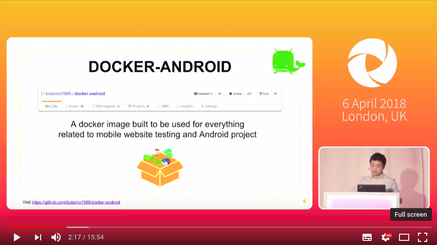

<p align="center">
  
</p>

[](https://gitter.im/butomo1989/docker-android?utm_source=badge&utm_medium=badge&utm_campaign=pr-badge&utm_content=badge)
[](https://travis-ci.org/butomo1989/docker-android)
[](https://hub.docker.com/r/butomo1989/docker-android-x86-7.1.1/)
[](https://codecov.io/gh/butomo1989/docker-android)
[](https://www.codacy.com/app/butomo1989/docker-appium?utm_source=github.com&amp;utm_medium=referral&amp;utm_content=butomo1989/docker-appium&amp;utm_campaign=Badge_Grade)

Docker-Android is a docker image built to be used for everything related to mobile website testing and Android project.

<p align="center">
   <a href="https://youtu.be/pQdpjuYwvp8"></a>
</p> 

Emulator - Samsung Device    | Emulator - Nexus Device     | Real Device  
:---------------------------:|:---------------------------:|:---------------------------:
![][emulator samsung]        |![][emulator nexus]          |![][real device]   

Purpose
-------

1. Run UI tests for mobile websites with [appium]
2. Build Android project and run unit tests with the latest build-tools
3. Run UI tests for Android applications with different frameworks ([appium], [espresso], [robotium], etc.)
4. Run monkey / stress tests
5. SMS testing

Advantages compare with other docker-android projects
-----------------------------------------------------

1. noVNC to see what happen inside docker container
2. Emulator for different devices / skins, such as Samsung Galaxy S6, LG Nexus 4, HTC Nexus One and more.
3. Ability to connect to Selenium Grid
4. Ability to control emulator from outside container by using adb connect
5. Support real devices with screen mirroring
6. Ability to record video during test execution for debugging
7. Open source with more features coming

List of Docker images
---------------------

|Supported OS   |Android version   |API level   |Image name   |Image status   |
|:---|:---|:---|:---|:---:|
|Linux|5.0.1|21|butomo1989/docker-android-x86-5.0.1|[](https://microbadger.com/images/butomo1989/docker-android-x86-5.0.1 "Get your own image badge on microbadger.com")|
|Linux|5.1.1|22|butomo1989/docker-android-x86-5.1.1|[](https://microbadger.com/images/butomo1989/docker-android-x86-5.1.1 "Get your own image badge on microbadger.com")|
|Linux|6.0|23|butomo1989/docker-android-x86-6.0|[](https://microbadger.com/images/butomo1989/docker-android-x86-6.0 "Get your own image badge on microbadger.com")|
|Linux|7.0|24|butomo1989/docker-android-x86-7.0|[](https://microbadger.com/images/butomo1989/docker-android-x86-7.0 "Get your own image badge on microbadger.com")|
|Linux|7.1.1|25|butomo1989/docker-android-x86-7.1.1|[](https://microbadger.com/images/butomo1989/docker-android-x86-7.1.1 "Get your own image badge on microbadger.com")|
|Linux|8.0|26|butomo1989/docker-android-x86-8.0|[](https://microbadger.com/images/butomo1989/docker-android-x86-8.0 "Get your own image badge on microbadger.com")|
|Linux|8.1|27|butomo1989/docker-android-x86-8.1|[](https://microbadger.com/images/butomo1989/docker-android-x86-8.1 "Get your own image badge on microbadger.com")|
|All |-|-|butomo1989/docker-android-real-device|[](https://microbadger.com/images/butomo1989/docker-android-real-device "Get your own image badge on microbadger.com")|
|Linux|All|All|butomo1989/docker-android-genymotion|[](https://microbadger.com/images/butomo1989/docker-android-genymotion "Get your own image badge on microbadger.com")|

List of Devices
---------------

Type   | Device Name
-----  | -----
Phone  | Samsung Galaxy S6
Phone  | Nexus 4
Phone  | Nexus 5
Phone  | Nexus One
Phone  | Nexus S
Tablet | Nexus 7

Requirements
------------

Docker is installed in your system.

Quick Start
-----------

1. Run docker-android

	- For ***Linux OS***, please use image name that contains "x86"

		```bash
		docker run --privileged -d -p 6080:6080 -p 5554:5554 -p 5555:5555 -e DEVICE="Samsung Galaxy S6" --name android-container butomo1989/docker-android-x86-8.1
		```

	- For ***OSX*** and ***Windows OS***, please use Virtual Machine that support Virtualization with Ubuntu OS


2. Verify the ip address of docker host.

   - For OSX, you can find out by using following command:

     ```bash
     docker-machine ip default
     ```

   - For different OS, localhost should work.

3. Open ***http://docker-host-ip-address:6080*** from web browser.

Run Appium Server
-----------------

Appium is automation test framework to test mobile website and mobile application, including android. To be able to use appium, you need to run appium-server. You run appium server inside docker-android container by ***opening port 4723*** and ***passing an environment variable APPIUM=true***.

```bash
docker run --privileged -d -p 6080:6080 -p 5554:5554 -p 5555:5555 -p 4723:4723 -e DEVICE="Samsung Galaxy S6" -e APPIUM=true --name android-container butomo1989/docker-android-x86-8.1
```

### Connect to Selenium Grid

It is also possible to connect appium server that run inside docker-android with selenium grid by passing following environment variables:

- CONNECT\_TO\_GRID=true
- APPIUM_HOST="\<host\_ip\_address>"
- APPIUM_PORT=\<port\_number>
- SELENIUM_HOST="\<host\_ip\_address>"
- SELENIUM_PORT=\<port\_number>

To run tests for mobile browser, following parameter can be passed:

- MOBILE\_WEB\_TEST=true

```bash
docker run --privileged -d -p 6080:6080 -p 4723:4723 -p 5554:5554 -p 5555:5555 -e DEVICE="Samsung Galaxy S6" -e APPIUM=true -e CONNECT_TO_GRID=true -e APPIUM_HOST="127.0.0.1" -e APPIUM_PORT=4723 -e SELENIUM_HOST="172.17.0.1" -e SELENIUM_PORT=4444 -e MOBILE_WEB_TEST=true --name android-container butomo1989/docker-android-x86-8.1
```

### Share Volume

If you want to use appium to test UI of your android application, you need to share volume where the APK is located to folder ***/root/tmp***.

```bash
docker run --privileged -d -p 6080:6080 -p 4723:4723 -p 5554:5554 -p 5555:5555 -v $PWD/example/sample_apk:/root/tmp -e DEVICE="Nexus 5" -e APPIUM=true -e CONNECT_TO_GRID=true -e APPIUM_HOST="127.0.0.1" -e APPIUM_PORT=4723 -e SELENIUM_HOST="172.17.0.1" -e SELENIUM_PORT=4444 --name android-container butomo1989/docker-android-x86-8.1
```

### Video Recording

You can deactivate auto_record by changing the value to "False" in docker-compose file. e.g. change value to "False" in this [line].

### Docker-Compose

![][compose]

There is [example of compose file] to run complete selenium grid and docker-android container as nodes. [docker-compose] version [1.13.0] or higher is required to be able to execute that compose file.

```bash
docker-compose up -d
```

Build Android project
---------------------

docker-android can be used for building Android project and executing its unit test. This following steps will illustrate how to build Android project:

1. Clone [this sample test project](https://github.com/googlesamples/android-testing).

	```bash
	git clone git@github.com:googlesamples/android-testing.git
	```

2. Build the project

	```bash
	docker run -it --rm -v $PWD/android-testing/ui/espresso/BasicSample:/root/tmp butomo1989/docker-android-x86-8.1 tmp/gradlew build
	```

Proxy
-----

You can enable proxy inside container by passing following environment variables:

- HTTP_PROXY="\<docker\_bridge\_ip\_address>"
- HTTPS_PROXY="\<docker\_bridge\_ip\_address>"
- NO_PROXY="localhost"

Relaxed Security
-----

Pass environment variable RELAXED_SECURITY=true to disable additional security check to use some advanced features.

Genymotion
----------


Docker-Android supports [Genymotion Cloud]. 

You can easily scale your Appium tests on Genymotion Android virtual devices in the cloud. 
Use [device.json] to define the device to start. You can specify the port on which the device will start so you don't need to change the device name in your tests every time you need to run those tests. Then run following command

```bash
export USER="xxx"
export PASS="xxx"
export LICENSE="xxx"

docker run -it --rm -p 4723:4723 -v $PWD/genymotion/example/sample_devices:/root/tmp -e USER=$USER -e PASS=$PASS -e LICENSE=$LICENSE butomo1989/docker-android-genymotion
```

You can also use [this docker-compose file].

<p align="center">
   <a href="https://youtu.be/jXhUEyaVeMY"></a>
</p>


Control android emulator outside container
------------------------------------------

```bash
adb connect <docker-machine-ip-address>:5555
```

![][adb_connection]

**Note:** You need to have Android Debug Bridge (adb) installed in your host machine.

SMS Simulation
--------------

1. Using telnet
	- Find the auth_token and copy it.

	 ```bash
	 docker exec -it android-container cat /root/.emulator_console_auth_token
	 ```

	- Access emulator using telnet and login with auth_token

	 ```bash
	 telnet <docker-machine-ip-address> 5554
	 ```

	- Login with given auth_token from 1.step

	 ```bash
	 auth <auth_token>
	 ```

	- Send the sms

	 ```bash
	 sms send <phone_number> <message>
	 ```

2. Using adb

	 ```bash
	 docker exec -it android-container adb emu sms send <phone_number> <message>
	 ```

3. You can also integrate it inside project using adb library.

![][sms]

How to use docker-android in VMWare or Parallels Desktop
---------------
The following instructions are used for OS X. You'll need [docker-machine-parallels](https://github.com/Parallels/docker-machine-parallels) to create a virtual machine (vm) with tiny core linux for running docker images. After that, you may start the vm you created for VMWare Fusion or Parallels Desktop and run a docker container inside this vm. If you're going to use the android docker of emulator with x86 processor, setup this vm for nested virtualization and kvm support before you run a docker container.

1. Install docker-machine-parallels via Homebrew:
    ```bash
    $ brew install docker-machine-parallels
    ```

2. Create a virtual machine for running docker images based on the virtual machine tool you use

    2.1. Create a virtual machine of VMWare Fusion
    ```bash
    $ docker-machine create --driver=vmwarefusion vmware-dev
    ```

    2.2. Create a virtual machine of Parallels Desktop
    ```bash
    $ docker-machine create --driver=parallels prl-dev
    ```
    
    This utility `docker-machine-parallels` will fetch boot2docker.iso to create a vm of VMWare fusion or Parallels Desktop. When the vm is created, you'll see it's booted with VMWare fusion or Parallels Desktop where the network of vm is set to NAT and one IP is assigned. You'll be able to connect to vnc service inside the docker image through that IP. Say it's `10.211.55.3` and we'll use it later.

3. Setup the virtual machine for nested virtualization support

    3.1. Shutdown the vm by running the command below in the boot2docker vm before you setup it.
    ```bash
    # shutdown -h now
    ```

    If you use VMWare Fusion, go to menu bar > Vitual Machine > Settings > Processors and Memory, expand Advanced options, and select `Enable hypervisor applications in this virtual machine`.
    
    
    
    If you use Parallels Desktop, open settings screen of that vm and go to `CPU & Memory` under `hardware` tab, expand Advanced settings and select `Enable nested virtualization`.
    
    

4. Enable kvm inside virtual machine
    4.1. Run as an account other than root to install kvm packages using tce-load.
    ```bash
    # su docker
    $ tce-load -wi kvm
    ```

    4.2. Run as root to load kvm module after kvm packages install.
    ```bash
    $ sudo modprobe kvm_intel
    ```

    4.3. Check if the kvm device is loaded.
    ```bash
    $ ls /dev/kvm
    ```

    4.4. Check if your CPU supports hardware virtualization now
    ```bash
    $ egrep -c '(vmx|svm)' /proc/cpuinfo
    ```

    If **0** it means that your CPU doesn't support hardware virtualization.
    If **1** or more it does - but you still need to make sure that virtualization is enabled in the BIOS.

5. You may now run a docker container
    5.1. Let's run a docker image for an emulator with x86 processor.
    ```bash
    docker run --privileged -d -p 6080:6080 -p 5554:5554 -p 5555:5555 -e DEVICE="Samsung Galaxy S6" --name android-container butomo1989/docker-android-x86-8.1
    ```

    When the services inside this docker container are running, connect to http://10.211.55.3:6080/vnc.html (the IP we got when the docker machine was created) and login. The emulator with x86 processor should be running on screen.

Troubleshooting
---------------
All logs inside container are stored under folder **/var/log/supervisor**. you can print out log file by using **docker exec**. Example:

```bash
docker exec -it android-container tail -f /var/log/supervisor/docker-android.stdout.log
```

Special Thanks
--------------
- [Gian Christanto] for creating a great logo!

[appium]: <https://appium.io>
[espresso]: <https://google.github.io/android-testing-support-library/docs/espresso/>
[robotium]: <https://github.com/RobotiumTech/robotium>
[emulator samsung]: <images/emulator_samsung_galaxy_s6.png>
[emulator nexus]: <images/emulator_nexus_5.png>
[real device]: <images/real_device.png>
[compose]: <images/compose.png>
[line]: <https://github.com/butomo1989/docker-android/blob/master/docker-compose.yml#L70>
[example of compose file]: <docker-compose.yml>
[docker-compose]: <https://docs.docker.com/compose/install/>
[1.13.0]: <https://github.com/docker/compose/releases/tag/1.13.0>
[Genymotion Cloud]: <https://www.genymotion.com/cloud/>
[device.json]: <genymotion/example/sample_devices/devices.json>
[this docker-compose file]: <genymotion/example/geny.yml>
[adb_connection]: <images/adb_connection.png>
[sms]: <images/SMS.png>
[gian christanto]: <https://www.linkedin.com/in/gian-christanto-0b398b131/>
