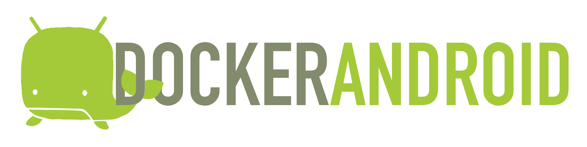
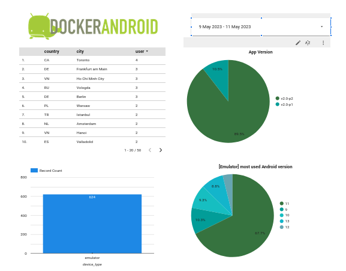

<p align="center">
  
</p>

[](https://github.com/igrigorik/ga-beacon "Analytics")
[](https://gitter.im/budtmo/docker-android?utm_source=badge&utm_medium=badge&utm_campaign=pr-badge&utm_content=badge)
[](https://dev.azure.com/budtmoos/budtmoos/_build/latest?definitionId=7&branchName=master)
[](https://codecov.io/gh/budtmo/docker-android)
[](https://www.codacy.com/app/butomo1989/docker-appium?utm_source=github.com&amp;utm_medium=referral&amp;utm_content=butomo1989/docker-appium&amp;utm_campaign=Badge_Grade)
[](https://github.com/budtmo/docker-android/releases)
[](https://app.fossa.io/projects/git%2Bgithub.com%2Fbudtmo%2Fdocker-android?ref=badge_shield)
[](http://paypal.me/budtmo)
[](http://makeapullrequest.com)

Docker-Android is a docker image built to be used for everything related to mobile website testing and Android project.

Emulator - Samsung Device    | Emulator - Nexus Device     | Real Device  
:---------------------------:|:---------------------------:|:---------------------------:
![][emulator samsung]        |![][emulator nexus]          |![][real device]   

Purposes
--------

1. Run UI tests for mobile websites with [appium]
2. Build Android project and run unit tests with the latest build-tools
3. Run UI tests for Android applications with different frameworks ([appium], [espresso], [robotium], etc.)
4. Run monkey / stress tests
5. SMS testing

Advantages compare with other docker-android projects
-----------------------------------------------------

1. noVNC to see what happen inside docker container
2. Emulator for different devices / skins, such as Samsung Galaxy S6, LG Nexus 4, HTC Nexus One and more.
3. Ability to connect to Selenium Grid
4. Ability to control emulator from outside container by using adb connect
5. Support real devices with screen mirroring
6. Ability to record video during test execution for debugging
7. Integrated with other cloud solutions, e.g. [Genymotion Cloud](https://www.genymotion.com/cloud/)
8. Open source with more features coming

List of Docker images
---------------------

|OS   |Android   |API   |Browser   |Browser version   |Chromedriver   |Image   |Size   |
|:---|:---|:---|:---|:---|:---|:---|:---|
|Linux|6.0|23|browser|44.0|2.18|budtmo/docker-android-x86-6.0|[](https://microbadger.com/images/budtmo/docker-android-x86-6.0 "Get your own image badge on microbadger.com")|
|Linux|7.0|24|chrome|51.0|2.23|budtmo/docker-android-x86-7.0|[](https://microbadger.com/images/budtmo/docker-android-x86-7.0 "Get your own image badge on microbadger.com")|
|Linux|7.1.1|25|chrome|55.0|2.28|budtmo/docker-android-x86-7.1.1|[](https://microbadger.com/images/budtmo/docker-android-x86-7.1.1 "Get your own image badge on microbadger.com")|
|Linux|8.0|26|chrome|58.0|2.31|budtmo/docker-android-x86-8.0|[](https://microbadger.com/images/budtmo/docker-android-x86-8.0 "Get your own image badge on microbadger.com")|
|Linux|8.1|27|chrome|61.0|2.33|budtmo/docker-android-x86-8.1|[](https://microbadger.com/images/budtmo/docker-android-x86-8.1 "Get your own image badge on microbadger.com")|
|Linux|9.0|28|chrome|66.0|2.40|budtmo/docker-android-x86-9.0|[](https://microbadger.com/images/budtmo/docker-android-x86-9.0 "Get your own image badge on microbadger.com")|
|Linux|10.0|29|chrome|74.0|74.0.3729.6|budtmo/docker-android-x86-10.0|[](https://microbadger.com/images/budtmo/docker-android-x86-10.0 "Get your own image badge on microbadger.com")|
|Linux|11.0|30|chrome|83.0|83.0.4103.39|budtmo/docker-android-x86-11.0|[](https://microbadger.com/images/budtmo/docker-android-x86-11.0 "Get your own image badge on microbadger.com")|
|Linux|12.0|31|chrome|93.0|93.0.4577.15|budtmo/docker-android-x86-12.0|[](https://microbadger.com/images/budtmo/docker-android-x86-12.0 "Get your own image badge on microbadger.com")|
|All |-|-|-|-|-|budtmo/docker-android-real-device|[](https://microbadger.com/images/budtmo/docker-android-real-device "Get your own image badge on microbadger.com")|
|All|All|All|All|All|All|budtmo/docker-android-genymotion|[](https://microbadger.com/images/budtmo/docker-android-genymotion "Get your own image badge on microbadger.com")|

List of Devices
---------------

Type   | Device Name
-----  | -----
Phone  | Samsung Galaxy S10
Phone  | Samsung Galaxy S9
Phone  | Samsung Galaxy S8
Phone  | Samsung Galaxy S7 Edge
Phone  | Samsung Galaxy S7
Phone  | Samsung Galaxy S6
Phone  | Nexus 4
Phone  | Nexus 5
Phone  | Nexus One
Phone  | Nexus S
Tablet | Nexus 7

Requirements
------------

Docker is installed in your system.

Quick Start
-----------

1. Your machine need to support virtualization. To check it:

	```
	sudo apt install cpu-checker
	kvm-ok
	```

2. Run Docker-Android

	- For ***Linux OS***, please use image name that contains "x86"

		```bash
		docker run --privileged -d -p 6080:6080 -p 5554:5554 -p 5555:5555 -e DEVICE="Samsung Galaxy S6" --name android-container budtmo/docker-android-x86-8.1
		```

	- For ***OSX*** and ***Windows OS***, please use Virtual Machine that support Virtualization with Ubuntu OS


3. Verify the ip address of docker host.

   - For OSX, you can find out by using following command:

     ```bash
     docker-machine ip default
     ```

   - For different OS, localhost should work.

4. Open ***http://docker-host-ip-address:6080*** from web browser. Note: Adding ```?view_only=true``` will give user only view only permission.

Custom configurations
---------------------

[This document](README_CUSTOM_CONFIG.md) contains custom configurations of Docker-Android that you might need, e.g. Proxy, Changing language on fly, etc.

Build Android project
---------------------

Docker-Android can be used for building Android project and executing its unit test. This following steps will illustrate how to build Android project:

1. Clone [this sample test project](https://github.com/android/testing-samples).

    ```bash
    git clone git@github.com:android/testing-samples.git
    ```

2. Build the project

    ```bash
    docker run -it --rm -v $PWD/testing-samples/ui/espresso/BasicSample:/tmp -w /tmp budtmo/docker-android-x86-8.1 /tmp/gradlew build
    ```

Control Android connected to host (Emulator or Real Device)
-----------------------------------------------------------
1. Create a docker container with this command

	```
	$ docker run --privileged -d -p 6080:6080 -p 5554:5554 -p 5555:5555 -p 4723:4723 --name android-container-appium budtmo/docker-android-real-device
	```

2. Open noVNC [http://localhost:6080](http://localhost:6080)

3. Open terminal by clicking right on **noVNC** window >> **Terminal emulator**

4. To connect to host's adb (make sure your host have adb and connected to the device.)

	```
	$ adb -H host.docker.internal devices
	```

	To specify port, just add `-P port_number`

	```
	$ adb -H host.docker.internal -P 5037 devices
	```

5. Now your container can access your host devices. But, you need to add `remoteAdbHost` and `adbPort` desired capabilities to make **Appium** can recognise those devices.  


Appium and Selenium Grid
------------------------

If you want to use Appium and Selenium Grid, you can follow [this document](README_APPIUM_AND_SELENIUM.md). It also contains sample and use cases.

Control android emulator outside container
------------------------------------------

```bash
adb connect <docker-machine-ip-address>:5555
```

![][adb_connection]

**Note:** You need to have Android Debug Bridge (adb) installed in your host machine.

SMS Simulation
--------------

1. Using telnet
	- Find the auth_token and copy it.

	 ```bash
	 docker exec -it android-container cat /root/.emulator_console_auth_token
	 ```

	- Access emulator using telnet and login with auth_token

	 ```bash
	 telnet <docker-machine-ip-address> 5554
	 ```

	- Login with given auth_token from 1.step

	 ```bash
	 auth <auth_token>
	 ```

	- Send the sms

	 ```bash
	 sms send <phone_number> <message>
	 ```

2. Using adb

	 ```bash
	 docker exec -it android-container adb emu sms send <phone_number> <message>
	 ```

3. You can also integrate it inside project using adb library.

![][sms]

Google Play Services and Google Play Store
------------------------------------------
Not installed at this time.

Jenkins
-------

This [document](README_JENKINS.md) gives you information about custom plugin that supports Docker-Android.

VMWARE
------

This [document](README_VMWARE.md) shows you how to configure Virtual Machine on VMWARE to be able to run Docker-Android.

Cloud
-----

This [document](README_CLOUD.md) contains information about deploying Docker-Android on cloud services.

Genymotion
----------

<p align="center">
  
</p>

For you who do not have ressources to maintain the simulator or to buy machines or need different device profiles, you need to give a try to [Genymotion Cloud](https://www.genymotion.com/cloud/). Docker-Android is integrated with Genymotion on different cloud services, e.g. Genymotion Cloud, AWS, GCP, Alibaba Cloud. Please follow [this document](README_GENYMOTION.md) or [this blog](https://medium.com/genymobile/run-your-appium-tests-using-docker-android-genymotion-cloud-e4817132ccd8) for more detail.

Troubleshooting
---------------
All logs inside container are stored under folder **/var/log/supervisor**. you can print out log file by using **docker exec**. Example:

```bash
docker exec -it android-container tail -f /var/log/supervisor/docker-android.stdout.log
```

Emulator Skins
--------------
The Emulator skins are taken from [Android Studio IDE](https://developer.android.com/studio) and [Samsung Developer Website](https://developer.samsung.com/)


Monitoring
----------
You can use [cadvisor](https://github.com/google/cadvisor) combined with influxdb / prometheus and grafana if needed to monitor each running container.

Users
-----
Docker-Android are being used by 100+ countries around the world.

[](https://datastudio.google.com/s/ht7HVKHKAQE)

Stargazers over time
--------------------

[](https://starchart.cc/budtmo/docker-android)

Special Thanks
--------------
- [Gian Christanto] for creating a great logo!

LICENSE
--------------
See [License](LICENSE.md)

[](https://app.fossa.io/projects/git%2Bgithub.com%2Fbudtmo%2Fdocker-android?ref=badge_large)

[appium]: <https://appium.io>
[espresso]: <https://developer.android.com/training/testing/espresso/>
[robotium]: <https://github.com/RobotiumTech/robotium>
[emulator samsung]: <images/emulator_samsung_galaxy_s6.png>
[emulator nexus]: <images/emulator_nexus_5.png>
[real device]: <images/real_device.png>
[adb_connection]: <images/adb_connection.png>
[sms]: <images/SMS.png>
[gian christanto]: <https://www.linkedin.com/in/gian-christanto-0b398b131/>
