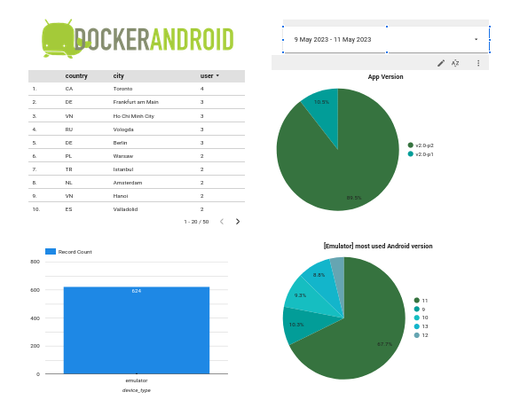

<p align="center">
  
</p>

[](http://paypal.me/budtmo) [](http://makeapullrequest.com) [](https://codecov.io/gh/budtmo/docker-android) [](https://gitter.im/budtmo/docker-android?utm_source=badge&utm_medium=badge&utm_campaign=pr-badge&utm_content=badge) [](https://github.com/budtmo/docker-android/releases)

Docker-Android is a docker image built to be used for everything related to Android. It can be used for Application development and testing (native, web and hybrid-app).

Advantages of using this project
--------------------------------
1. Emulator with different device profile and skins, such as Samsung Galaxy S6, LG Nexus 4, HTC Nexus One and more.
2. Support vnc to be able to see what happen inside docker container
3. Support log sharing feature where all logs can be accessed from web-UI
4. Ability to control emulator from outside container by using adb connect
5. Integrated with other cloud solutions, e.g. [Genymotion Cloud](https://www.genymotion.com/cloud/)
6. It can be used to build Android project
7. It can be used to run unit and UI-Test with different test-frameworks, e.g. Appium, Espresso, etc.
8. It support mcp server (beta-version)

List of Docker-Images
---------------------
|Android   |API   |Image with latest release version   |Image with specific release version|
|:---|:---|:---|:---|
|9.0|28|budtmo/docker-android:emulator_9.0|budtmo/docker-android:emulator_9.0_<release_version>|
|10.0|29|budtmo/docker-android:emulator_10.0|budtmo/docker-android:emulator_10.0_<release_version>|
|11.0|30|budtmo/docker-android:emulator_11.0|budtmo/docker-android:emulator_11.0_<release_version>|
|12.0|32|budtmo/docker-android:emulator_12.0|budtmo/docker-android:emulator_12.0_<release_version>|
|13.0|33|budtmo/docker-android:emulator_13.0|budtmo/docker-android:emulator_13.0_<release_version>|
|14.0|34|budtmo/docker-android:emulator_14.0|budtmo/docker-android:emulator_14.0_<release_version>|
|-|-|budtmo/docker-android:genymotion|budtmo/docker-android:genymotion_<release_version>|
|-|-|budtmo/docker-android:mcp|budtmo/docker-android:mcp_<release_version>|

List of Devices
---------------

Type   | Device Name
-----  | -----
Phone  | Samsung Galaxy S10
Phone  | Samsung Galaxy S9
Phone  | Samsung Galaxy S8
Phone  | Samsung Galaxy S7 Edge
Phone  | Samsung Galaxy S7
Phone  | Samsung Galaxy S6
Phone  | Nexus 4
Phone  | Nexus 5
Phone  | Nexus One
Phone  | Nexus S
Tablet | Nexus 7
Tablet | Pixel C

Requirements
------------

1. Docker is installed on your system.

Quick Start
-----------

1. If you use ***Ubuntu OS*** on your host machine, you can skip this step. For ***OSX*** and ***Windows OS*** user, you need to use Virtual Machine that support Virtualization with Ubuntu OS because the image can be run under ***Ubuntu OS only***.

2. Your machine should support virtualization. To check if the virtualization is enabled is:
    ```
    sudo apt install cpu-checker
    kvm-ok
    ```

3. Run Docker-Android container
    ```
    docker run -d -p 6080:6080 -e EMULATOR_DEVICE="Samsung Galaxy S10" -e WEB_VNC=true --device /dev/kvm --name android-container budtmo/docker-android:emulator_11.0
    ```

4. Open ***http://localhost:6080*** to see inside running container.

5. To check the status of the emulator
    ```
    docker exec -it android-container cat device_status
    ```

Persisting data
-----------

The default behaviour is to destroy the emulated device on container restart. To persist data, you need to mount a volume at `/home/androidusr`:
    ```
    docker run -v data:/home/androidusr budtmo/docker-android:emulator_11.0
    ```

WSL2 Hardware acceleration (Windows 11 only)
-----------

Credit goes to [Guillaume - The Parallel Interface blog](https://www.paralint.com/2022/11/find-new-modified-and-unversioned-subversion-files-on-windows)

[Microsoft - Advanced settings configuration in WSL](https://learn.microsoft.com/en-us/windows/wsl/wsl-config)


1. Add yourself to the `kvm` usergroup.
    ```
    sudo usermod -a -G kvm ${USER}
    ```

2. Add necessary flags to `/etc/wsl.conf` to their respective sections.
    ```
    [boot]
    command = /bin/bash -c 'chown -v root:kvm /dev/kvm && chmod 660 /dev/kvm'
    ```

    Then, using PowerShell, open a notepad on `notepad $env:USERPROFILE\.wslconfig`. Inside, put these other flags:
    ```
    [wsl2]
    nestedVirtualization=true
    ```

4. Restart WSL2 via CMD prompt or Powershell
    ```
    wsl --shutdown
    ```


`command = /bin/bash -c 'chown -v root:kvm /dev/kvm && chmod 660 /dev/kvm'` sets `/dev/kvm` to `kvm` usergroup rather than the default `root` usergroup on WSL2 startup.

`nestedVirtualization` flag is only available to Windows 11.

If this setup does not work, you may have an old WSL version. In that case, ignore `\.wslconfig` and put everything on `/etc/wsl.conf`, including the `[wsl2]` flag.

Use-Cases
---------

1. [Build Android project](./documentations/USE_CASE_BUILD_ANDROID_PROJECT.md)
2. [UI-Test with Appium](./documentations/USE_CASE_APPIUM.md)
3. [Control Android emulator on host machine](./documentations/USE_CASE_CONTROL_EMULATOR.md)
4. [SMS Simulation](./documentations/USE_CASE_SMS.md)
5. [Jenkins](./documentations/USE_CASE_JENKINS.md)
6. [Deploying on cloud (Azure, AWS, GCP)](./documentations/USE_CASE_CLOUD.md)

Custom-Configurations
---------------------

This [document](./documentations/CUSTOM_CONFIGURATIONS.md) contains information about configurations that can be used to enable some features, e.g. log-sharing, etc.

Genymotion
----------

<p align="center">
  
</p>

For you who do not have ressources to maintain the simulator or to buy machines or need different device profiles, you can give a try by using [Genymotion SAAS](https://cloud.geny.io/). Docker-Android is [integrated with Genymotion](https://www.genymotion.com/blog/partner_tag/docker/) on different cloud services, e.g. Genymotion SAAS, AWS, GCP, Alibaba Cloud. Please follow [this document](./documentations/THIRD_PARTY_GENYMOTION.md) for more detail.

Emulator Skins
--------------
The Emulator skins are taken from [Android Studio IDE](https://developer.android.com/studio) and [Samsung Developer Website](https://developer.samsung.com/)

USERS
-----

<a href="https://lookerstudio.google.com/s/iGaemHJqQvg">
  <p align="center">
    
  </p>
</a>

PRO VERSION
-----------

Due to high requests for help and to be able to actively maintain the projects, the creator has decided to create docker-android-pro. Docker-Android-Pro is a sponsor based project which mean that the docker image of pro-version can be pulled only by [active sponsor](https://github.com/sponsors/budtmo).

The differences between normal version and pro version are:

|Feature   |Normal   |Pro   |Comment|
|:---|:---|:---|:---|
|user-behavior-analytics|Yes|No|-|
|proxy|No|Yes|Set up company proxy on Android emulator on fly|
|language|No|Yes|Set up language on Android emulator on fly|
|Newer Android version|No|Yes|Support other newer Android version e.g. Android 15, Android 16, etc|
|root-privileged|No|Yes|Able to run command with security privileged|
|headless-mode|No|Yes|Save resources by using headless mode|
|Selenium 4.x integration|No|Yes|Running Appium UI-Tests againt one (Selenium Hub) endpoint for Android- and iOS emulator(s) / device(s)|
|multiple Android-Simulators|No|Yes (soon)|Save resources by having multiple Android-Simulators on one docker-container|
|Google Play Store|No|Yes (soon)|-|
|Video Recording|No|Yes (soon)|Helpful for debugging|

This [document](./documentations/DOCKER-ANDROID-PRO.md) contains detail information about how to use docker-android-pro.

SPONSORS
--------

<p align="center">
  <a href="https://www.swiftproxy.net/?ref=budtmo">
    
  </a>
</p>

**Swiftproxy** — **Swiftproxy** provides high-quality residential proxies for Android testing, automation, and location-based workflows. With **90M+ residential IPs**, HTTP(S)/SOCKS5 support, flexible targeting, and **non-expiring traffic**, Swiftproxy helps users test apps and online services from different locations. **Try Swiftproxy for free today** and get **10% off with code PROXY90**.

[Learn more about Swiftproxy →](https://www.swiftproxy.net/?ref=budtmo)

<p align="center">
  <a href="https://www.rapidproxy.io/?ref=budtmo">
    
  </a>
</p>

**RapidProxy** — **RapidProxy** is a high-performance proxy provider built for automation and multi-account operations,     offering clean residential proxies and native static ISP IPs. Access 90 million+ residential IPs worldwide, with intelligent rotation, sticky sessions, and support for high-concurrency requests. Ideal for web scraping, browser automation, social media account management, e-commerce, and bulk account registration. Residential proxies start at just $0.55/GB, with bandwidth that never expires. **Use code RAPID10 for 10% off**.

[Learn more about Rapidproxy →](https://www.rapidproxy.io/?ref=budtmo)

LICENSE
-------
See [License](LICENSE.md)
