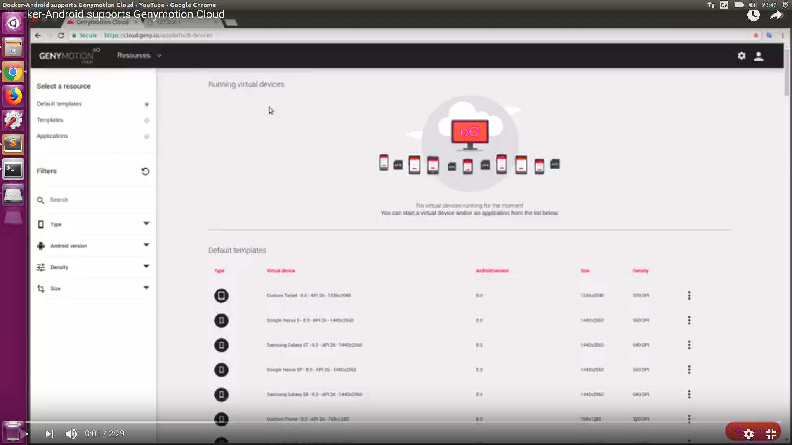

Genymotion Cloud
----------------

You can easily scale your Appium tests on Genymotion Android virtual devices in the cloud. They are available on SaaS or as virtual images on AWS, GCP or Alibaba Cloud.

1. On SaaS <br />
	Use [device.json](genymotion/example/sample_devices/devices.json) to define the device to start. You can specify the port on which the device will start so you don't need to change the device name in your tests every time you need to run those tests. Then run following command

	```bash
	export USER="xxx"
	export PASS="xxx"
	export LICENSE="xxx"

	docker run -it --rm -p 4723:4723 -v $PWD/genymotion/example/sample_devices:/root/tmp -e TYPE=genycloud -e USER=$USER -e PASS=$PASS -e LICENSE=$LICENSE butomo1989/docker-android-genymotion
	```

<p align="center">
   <a href="https://youtu.be/jXhUEyaVeMY"></a>
</p>

2. On PaaS (AWS) <br />
	Use [aws.json](genymotion/example/sample_devices/aws.json) to define configuration of EC2 instance and run following command:

	```bash
	docker run -it --rm -p 4723:4723 -v $PWD/genymotion/example/sample_devices:/root/tmp -v ~/.aws:/root/.aws -e TYPE=aws butomo1989/docker-android-genymotion
	```

You can also use [this docker-compose file](genymotion/example/geny.yml). 
