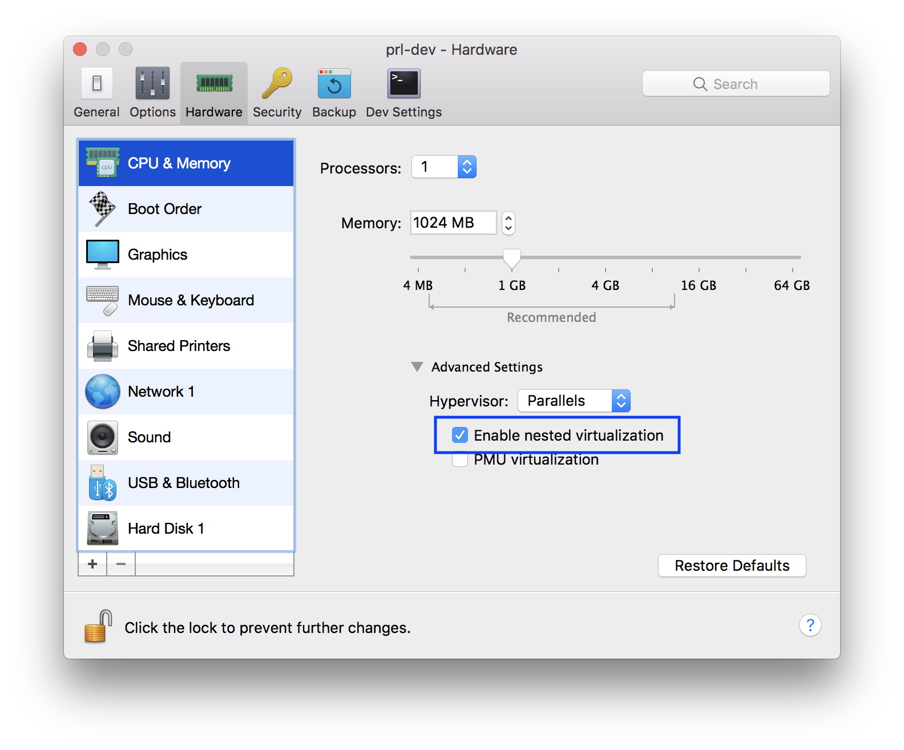

VMWare Fusion on OSX
--------------------

The following instructions are used for OS X. You'll need [docker-machine-parallels](https://github.com/Parallels/docker-machine-parallels) to create a virtual machine (vm) with tiny core linux for running docker images. After that, you may start the vm you created for VMWare Fusion or Parallels Desktop and run a docker container inside this vm. If you're going to use the android docker of emulator with x86 processor, setup this vm for nested virtualization and kvm support before you run a docker container.

1. Install docker-machine-parallels via Homebrew:
    ```bash
    $ brew install docker-machine-parallels
    ```

2. Create a virtual machine for running docker images based on the virtual machine tool you use

    2.1. Create a virtual machine of VMWare Fusion
    ```bash
    $ docker-machine create --driver=vmwarefusion vmware-dev
    ```

    2.2. Create a virtual machine of Parallels Desktop
    ```bash
    $ docker-machine create --driver=parallels prl-dev
    ```

    This utility `docker-machine-parallels` will fetch boot2docker.iso to create a vm of VMWare fusion or Parallels Desktop. When the vm is created, you'll see it's booted with VMWare fusion or Parallels Desktop where the network of vm is set to NAT and one IP is assigned. You'll be able to connect to vnc service inside the docker image through that IP. Say it's `10.211.55.3` and we'll use it later.

3. Setup the virtual machine for nested virtualization support

    3.1. Shutdown the vm by running the command below in the boot2docker vm before you setup it.
    ```bash
    # shutdown -h now
    ```

    If you use VMWare Fusion, go to menu bar > Vitual Machine > Settings > Processors and Memory, expand Advanced options, and select `Enable hypervisor applications in this virtual machine`.

    

    If you use Parallels Desktop, open settings screen of that vm and go to `CPU & Memory` under `hardware` tab, expand Advanced settings and select `Enable nested virtualization`.

    

4. Enable kvm inside virtual machine

    4.0 SSH to the machine
    ```bash
    docker-machine ssh vmware-dev
    ```

    4.1 Check kvm version
    ```bash
    # version
    $ 10.1
    ```
    
    Go to http://tinycorelinux.net/10.x/x86_64/tcz/ and check your kvm version, for version 10.1 is kvm-4.19.10-tinycore64.tcz
    
    4.2. Run as an account other than root to install kvm packages using tce-load.
    ```bash
    # su docker
    $ tce-load -wi kvm-4.19.10-tinycore64.tcz
    ```

    4.3. Run as root to load kvm module after kvm packages install.
    ```bash
    $ sudo modprobe kvm_intel
    ```

    4.4. Check if the kvm device is loaded.
    ```bash
    $ ls /dev/kvm
    ```

    4.5. Check if your CPU supports hardware virtualization now
    ```bash
    $ egrep -c '(vmx|svm)' /proc/cpuinfo
    ```

    If **0** it means that your CPU doesn't support hardware virtualization.
    If **1** or more it does - but you still need to make sure that virtualization is enabled in the BIOS.

5. You may now run a docker container
    5.1. Let's run a docker image for an emulator with x86 processor.
    ```bash
    docker run --privileged -d -p 6080:6080 -p 5554:5554 -p 5555:5555 -e DEVICE="Samsung Galaxy S6" --name android-container budtmo/docker-android-x86-8.1
    ```

    When the services inside this docker container are running, connect to http://10.211.55.3:6080/vnc.html (the IP we got when the docker machine was created) and login. The emulator with x86 processor should be running on screen.
