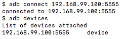

Control emulator from host machine
----------------------------------

1. Open port 5554 and 5555 while running docker-android container
	 ```
	 docker run ... -p 5554:5554 -p 5555:5555 ...
	 ```

2. Connect emulator inside docker-android container with host adb
	 ```
	 adb connect <docker-machine-ip-address>:5555
	 ```




[<- BACK TO README](../README.md)
